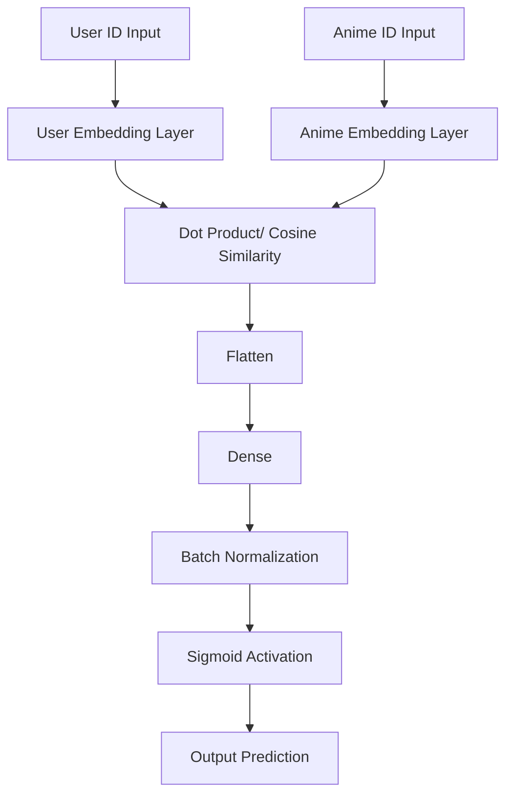
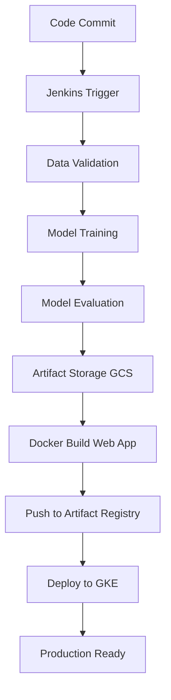

# 🎌 Anime Recommender System

A production-ready machine learning recommendation system that provides personalized anime recommendations using collaborative filtering and content-based approaches. Built with modern MLOps practices and deployed on Google Cloud Platform.  

### IMP Note 
- For Local development, We are following the below but for Production we will Deploy our Jenkins in a Google Cloud VM and set up all these step via the Jenkinsfile so the pipeline Runs Effectively. I deleted my VM for jenkins because I made this to showcase my tech stack and skills while using the free credits of GCP and I don't have enough money to keep that running. Also I deleted everything from the Google Cloud But I hosted the Docker Image in Hugging Face You can visit [Anime Recommender](https://huggingface.co/spaces/aman-yadav-ds/anime-recommender).

## 🏗️ Architecture Overview

```
          [Jenkins]
              |
              v
  [Ingest Data from GCS Bucket] 
              |
              v
  [DVC status check & DVC repro] ---> [Training Pipeline] ---> [Docker push artifacts in GCS ]
              |                                                                |
              v                                                                |
  [Pipeline Docker Image Build] <----------------------------------------------┛
              |
              v
      [Deploy to GKE]                                                
```

## 🚀 Key Features

- **Recommendation Engine**: Based on similarity scores on user_ids and anime_ids
- **Optimized CI/CD Pipeline**: Jenkins pipeline with Docker optimization reducing image size from 10GB to lightweight containers
- **Cloud-Native Deployment**: Scalable deployment on Google Kubernetes Engine (GKE)
- **Data Versioning**: DVC integration for reproducible ML experiments
- **Production-Ready**: Flask API with responsive web interface

## 🛠️ Technology Stack

### **Backend & ML**
- **Python 3.11+**: Core programming language
- **TensorFlow/Keras**: Deep learning framework for training recommendation model
- **Pandas & NumPy**: Data manipulation and numerical computing
- **Scikit-learn**: Additional ML utilities and preprocessing

### **Web Framework**
- **Flask**: Lightweight web framework for API development
- **HTML/CSS/JavaScript**: Frontend user interface

### **MLOps & DevOps**
- **Jenkins**: CI/CD pipeline automation
- **Docker**: Containerization and deployment
- **DVC**: Data and model version control.
- **CometML**: Model metrics and artifacts tracking
- **Git**: Source code version control

### **Cloud Infrastructure**
- **Google Cloud Platform (GCP)**: Cloud provider
- **Google Kubernetes Engine (GKE)**: Container orchestration
- **Google Artifact Registry**: Container image storage
- **Google Cloud Storage**: Data and model artifact storage

## 📊 Data Flow Pipeline

### 1. **Data Ingestion**
```python
Raw Data Sources → CSV Files / Google Cloud Streaming → DVC Tracking
├── anime.csv                 (anime metadata)
├── animelist.csv             (user ratings)
└── anime_with_synopsis.csv   (content features)
```
- **anime.csv** — Metadata for each anime (title, type, episodes, rating, etc.)

- **anime_with_synopsis.csv** — Extended metadata with anime descriptions/synopses (used for content-based features).

- **animelist.csv** — Original dataset contains ~70M rows of user ratings.

Instead of loading it all into memory, I implemented selective ingestion via streaming from Google Cloud.

```python
with blob.open("r", encoding="utf-8") as gcs_file:
    data = pd.read_csv(
        gcs_file,
        nrows=5_000_000,
        low_memory=False
    )
```

For this project, only 5M rows were sampled for processing, drastically reducing load time and storage needs while keeping enough data for meaningful training.

### 2. **Data Processing**
- **Feature Engineering**: User-item interaction matrices
- **Data Cleaning**: Handling missing values and outliers
- **Encoding**: User and anime ID encoding for neural networks
- **Train/Test Split**: Only used 1000 instance for validation

Because we are not using the model to predict and instead using the embeddings trained by the data we don't need to care much for validation, but it is good if our model behaves well in validation too so we use 1000 instances and my Early stopping callback is set to monitor 'val_loss' so it stops if our validation loss doesn't improve in 3 epochs.

```python
early_stopping = EarlyStopping(
    monitor='val_loss',
    patience=3,
    mode='min',
    restore_best_weights=True,
    verbose=1
)
```

### 3. **Model Training**
- **Collaborative Filtering**: Implemented Neural Collaborative Filtering (NCF) architecture using user IDs and anime IDs as inputs.
- **Embedding Layers**: The model trains user embeddings and anime embeddings simultaneously.
- **Model Checkpointing**: Automatically saves the best performing weights during training based on validation loss.
```python
checkpoint = ModelCheckpoint(
    filepath=CHECKPOINT_FILE_PATH,
    save_weights_only=True,
    monitor='val_loss',
    mode='min',
    save_best_only=True,
    verbose=0
)
```

#### Model Architecture


### 4. Model Serving

- **Embedding-Based Recommendations**  
  - After training, the model’s **user** and **anime** embedding layers are extracted and saved.  
  - Recommendations are generated by computing **similarity scores** (e.g., cosine similarity) between embeddings rather than running inference through the model.  

- **Prediction Pipeline**  
  - Uses **precomputed embeddings** for fast, real-time recommendation generation.  
  - No need to load the full trained model during serving.  

- **API Endpoints**  
  - Flask API to return recommendations for a given **user ID** or **anime ID** using a good frontend web page.

- **Caching**  
  - Frequently requested recommendations poster are cached to minimize repeated poster fetching using requests.
```python
poster_cache = {}

def fetch_anime_posters(mal_id):
    global poster_cache

    response = requests.get(url)
    response.raise_for_status()
    data = response.json()
    image_url = data['data']['images']['jpg'].get('large_image_url') or \
                data['data']['images']['jpg'].get('image_url')

    poster_cache[mal_id] = image_url

    return image_url

```

**Serving Flow**:
```
User Based Recommendations                       Content based recommendations
    User ID                                               Anime ID
Saved User Embeddings            |------------------Saved Anime Embeddings 
      ↓                          |                            ↓                                            
Similar Users                    |                     Similar Anime
      ↓                          |                            |
Anime Users Rated highly         |                            |
      ↓                          |                            |
Similar Anime <-------------------                            |
      ↓                                                       |
Top-N Recommendations  <---------------------------------------
      ↓
API Response
```


## 🔧 Jenkins Pipeline Optimization

### **Problem**: Initial Docker Image Size (10GB)
- **(Story)** ->
Initially i was doing everthing Whole ML pipeline and flask web app service inside my docker Image:
- ❌ 10GB+ Docker image size
- ❌ Slow deployment times
- ❌ High storage costs
- ❌ Poor scalability

### **Solution**: Optimized Pipeline Architecture
```yaml
Jenkins Pipeline Stages:
1. Github repo pull
2. Making a virtual environment
3. Dvc pull to see changes in raw directory and ML pipeline .py files using dvc repro with command to run pipeline if changes are detected.
    a. 📥 Data Ingestion & Validation
    b. 🔄 Data Processing & Feature Engineering  
    c. 🧠 Model Training & Validation
    d. 📦 Model Artifact Storage (GCS)
4. Lightweight Web App Docker Build
5. Deploy to GKE using configuration described in deployment.yaml file
```

### **Optimization Benefits**
- ✅ **Reduced image size**: From 10GB to ~600MB (94% reduction)
- ✅ **Multi stage builds**: Reduced image size further by only copying needed dependecies.
- ✅ **Faster deployments**: 10x faster container startup
- ✅ **Separation of concerns**: ML training vs. web serving
- ✅ **Better resource utilization**: Efficient compute allocation
- ✅ **Cost optimization**: Reduced storage and transfer costs

### **Technical Implementation**
```dockerfile
# ===== Stage 1: Build dependencies =====
FROM python:3.10-slim AS builder
WORKDIR /app
RUN apt-get update && apt-get install -y --no-install-recommends \
    build-essential gcc && \
    rm -rf /var/lib/apt/lists/*
COPY pyproject.toml .
RUN pip install --upgrade pip && \
    pip install --no-cache-dir .[deployment]
# ===== Stage 2: Runtime =====
FROM python:3.10-slim
WORKDIR /app
COPY --from=builder /usr/local /usr/local
COPY . .
EXPOSE 10000
CMD ["gunicorn", "--bind", "0.0.0.0:10000", "application:app"]
```

## 🌐 Cloud Architecture

### **Google Kubernetes Engine (GKE)**
- **Auto-scaling**: Horizontal pod autoscaling based on CPU/memory
- **Load Balancing**: Distributed traffic across multiple instances: 3
- **Health Checks**: Automated container health monitoring
- **Rolling Updates**: Zero-downtime deployments

### **Google Artifact Registry**
- **Container Images**: Secure storage for Docker images
- **Version Management**: Tagged releases for different environments
- **Access Control**: IAM-based permissions and security

### **Google Cloud Storage**
- **Model Artifacts**: Trained models and preprocessing objects
- **Data Lake**: Raw and processed datasets
- **DVC Backend**: Remote storage for data version control

## 🚀 Getting Started

### **Prerequisites**
```bash
- Python 3.11+
- Docker
- Google Cloud SDK
- kubectl
```

### **Local Development**

- Make sure you have uploaded the csvs from [Dataset]("https://www.kaggle.com/datasets/hernan4444/anime-recommendation-database-2020") into a GCS bucket and have a sevice account made with (Storage Admin) and (Storage Object Viewer) roles. and then download the json file and set the env variable

```bash
gcloud auth login
#connect you google cloud account

export GOOGLE_APPLICATION_CREDENTIALS=<path to your json file without inverted commas.>
```
- Also update config.yaml in the config directory with
```yaml
data_ingestion:
  bucket_name: "Your_Bucket_Name"
  # Ensure you upload the csv and not the zip with these name or update the name here.
  bucket_file_names:
    - "anime.csv"
    - "anime_with_synopsis.csv"
    - "animelist.csv"
```

```bash
# Clone repository
git clone https://github.com/aman-yadav-ds/anime-recommender.git
cd anime-recommender

# Install dependencies
pip install -e .[development,deployment]

# Run ML pipeline
python pipeline/training_pipeline.py

# Start web application
python application.py
```

If you know how to use jenkins just host a local image of jenkins in you docker desktop and set up credentials and update the below with your credentials.

```jenkins
stage("Cloning from Github...."){
    steps{
        script{
            echo 'Cloning from Github...'
            checkout scmGit(branches: [[name: '*/{Your branch in github}']], extensions: [], userRemoteConfigs: [[credentialsId: '{your git hub token name}', url: '{Your git repository url}']])
        }
    }
}
```
Since this is too much work do -

### **Docker Deployment**
```bash
# Build image
docker build -t ImageName:Tag .

# Run container
docker run -p 10000:10000 ImageName:Tag
# Go to localhost:10000 in your browser
```

### **GCR Image Push**
```bash
gcloud config set project {Your Project Id}
gcloud auth configure-docker --quiet # Skips the confirmation with quiet
docker build -t gcr.io/{Your Project Id}/Image:tag .
docker push gcr.io/{Your Project Id}/Image:tag
```

### **GKE Deployment**
```bash
# Configure kubectl
gcloud container clusters get-credentials [CLUSTER_NAME] --region asia-south2
# This region is for india

# Deploy to GKE
kubectl apply -f deployment.yaml
```

## 📁 Project Structure

```
anime-recommender/
├── 📊 artifacts/               # Model artifacts and processed data
│   ├── model/                   # Trained models
│   ├── processed/              # Preprocessed datasets and other artifacts
│   ├── raw/                    # Raw data files
│   ├── model_checkpoints/      # Model weights
│   └── weights/                # Embedding layer embeddings
├── ⚙️ config/                  # Configuration files
│   ├── config.yaml             # Ingestion and 
│   └── paths_config.py         # File paths configuration
├── 📓 notebook/                # Jupyter notebooks for EDA
├── 🔄 pipeline/                # ML pipelines
│   ├── training_pipeline.py    # Model training workflow
│   └── prediction_pipeline.py  # Inference pipeline
├── 🧠 src/                     # Core ML modules
│   ├── data_ingestion.py       # Data loading and validation
│   ├── data_processing.py      # Data Cleaning
│   ├── model_training.py       # Model training logic
│   └── base_model.py           # Neural network architecture
├── 🎨 static/                  # Web assets (CSS, JS)
├── 📄 templates/               # HTML templates
├── 🔧 utils/                   # Utility and helper functions
├── 🐳 Dockerfile               # Container configuration
├── 🔄 Jenkinsfile              # CI/CD pipeline definition
├── 🔄 deployment.yaml          # GKE configuration
├── 🔄 dvc.yaml                 # DVC check and training initiation on data and code changes
└── 🚀 application.py           # Flask web application
```

## 📈 Model Performance

- **Collaborative Filtering**: Accuracy of 91% on test set and 77% on validation set (Not Imbalanced)
- **Inference Time**: < 250ms for recommendations

## 🔄 CI/CD Pipeline



## 🔐 Security & Best Practices

- **Environment Variables**: Sensitive configuration via secrets
- **Input Validation**: Sanitization of user inputs
- **Container Security**: Non-root user execution
- **Network Policies**: Kubernetes network segmentation

## 📊 Monitoring & Logging

- **Application Logs**: Structured logging with severity levels
- **Performance Metrics & Artifacts**: Logging Using CometML
- **Error Tracking**: Exception monitoring and alerting
- **Resource Usage**: CPU, memory, and storage utilization

## 🔮 Future Enhancements

- [ ] **Real-time Learning**: Online model updates with user feedback
- [ ] **A/B Testing**: Multi-armed bandit recommendation strategies
- [ ] **Advanced NLP**: Transformer-based content understanding
- [ ] **Microservices**: Service mesh architecture with Istio
- [ ] **GraphQL**: More flexible API query interface

## 🤝 Contributing

1. Fork the repository
2. Create a feature branch (`git checkout -b feature/amazing-feature`)
3. Commit your changes (`git commit -m 'Add amazing feature'`)
4. Push to the branch (`git push origin feature/amazing-feature`)
5. Open a Pull Request

## 📄 License

This project is licensed under the MIT License - see the [LICENSE](LICENSE) file for details.

## 👨‍💻 Author

**Aman Yadav** - *Data Scientist & ML Engineer*

- GitHub: [@aman-yadav-ds](https://github.com/aman-yadav-ds)
- LinkedIn: [Connect with me](https://www.linkedin.com/in/amandeep-yadav-2251b325a)

---

⭐ **Star this repository if you found it helpful!**


*This project demonstrates production-ready ML engineering with modern cloud-native practices, optimized CI/CD pipelines, and scalable architecture suitable for enterprise environments.*